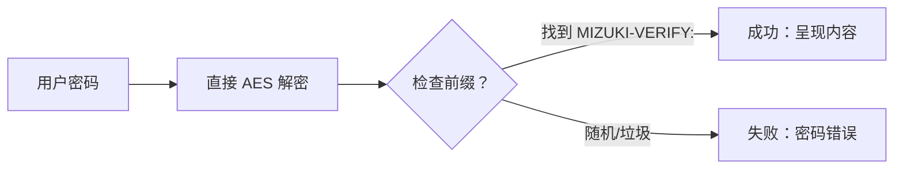

本博客模板使用 [Astro](https://astro.build/) 构建。对于本指南中未提及的内容，你可以在 [Astro 文档](https://docs.astro.build/)中找到答案。

## 文章前置数据

```yaml
---
title: 我的第一篇博客文章
published: 2023-09-09
description: 这是我的新 Astro 博客的第一篇文章。
image: ./cover.jpg
tags: [Foo, Bar]
category: 前端
draft: false
---
```


| 属性 | 描述 |
|---|---|
| `title` | 文章的标题。 |
| `published` | 文章发布的日期。 |
| `pinned` | 该文章是否固定在文章列表的顶部。 |
| `description` | 文章的简短描述。在索引页面上显示。 |
| `image` | 文章的封面图片路径。<br/>1. 以 `http://` 或 `https://` 开头：使用网络图片<br/>2. 以 `/` 开头：`public` 目录中的图片<br/>3. 没有上述前缀：相对于 markdown 文件 |
| `tags` | 文章的标签。 |
| `category` | 文章的分类。 |
| `alias` | 文章的别名。该文章可在 `/posts/{alias}/` 访问。示例：`my-special-article`（将在 `/posts/my-special-article/` 可用） |
| `licenseName` | 文章内容的许可证名称。 |
| `author` | 文章的作者。 |
| `sourceLink` | 文章内容的源链接或参考。 |
| `draft` | 如果此文章仍然是草稿，则不会显示。 |
| `encrypted` | 该文章是否受密码保护。 |
| `password` | 解锁加密文章的密码。 |
| `passwordHint`| 帮助用户记住密码的提示。显示在密码输入框下方。 |
| `hideHomeContent` | 是否隐藏公开文章摘要，包括主页、元标签、源/API 摘要和分享预览。设置 `password` 时默认为 `true`。 |

## 文章放在哪里

你的文章文件应该放在 `src/content/posts/` 目录中。你也可以创建子目录来更好地组织你的文章和资源。

```
src/content/posts/
├── post-1.md
└── post-2/
    ├── cover.png
    └── index.md
```

## 文章别名

你可以通过在 front-matter 中添加 `alias` 字段来为任何文章设置别名：

```yaml
---
title: 我的特殊文章
published: 2024-01-15
alias: "my-special-article"
tags: ["示例"]
category: "技术"
---
```

设置别名时：
- 文章将在自定义 URL 上可访问（例如 `/posts/my-special-article/`）
- 默认的 `/posts/{slug}/` URL 仍然有效
- RSS/Atom 源将使用自定义别名
- 所有内部链接将自动使用自定义别名

**重要注意事项：**
- 别名不应包含 `/posts/` 前缀（它会自动添加）
- 避免在别名中使用特殊字符和空格
- 为获得最佳 SEO，使用小写字母和连字符
- 确保别名在所有文章中是唯一的
- 不要包含前导或尾部斜杠


## 它如何工作



## 页面加密

你可以通过设置 `encrypted: true` 并在 front-matter 中提供 `password` 来密码保护任何文章：

```yaml
---
title: 我的私密文章
published: 2024-01-15
encrypted: true
password: "my-secret-password"
passwordHint: "提示：密码是我的狗的名字"
hideHomeContent: true
---
```

### 字段

| 字段 | 必需 | 描述 |
|---|---|---|
| `encrypted` | 是 | 设置为 `true` 以启用密码保护 |
| `password` | 是 | 解锁文章的密码 |
| `passwordHint` | 否 | 显示在密码输入下方以帮助用户的提示 |
| `hideHomeContent` | 否 | 隐藏公开摘要为 `该文章已加密`。当设置 `password` 时默认为 `true`。设置为 `false` 以显示正常摘要。 |

### 解锁框的外观

解锁框显示：
- 主题原色的锁定图标
- 文章标题"密码保护"
- 要求输入密码的描述
- 提示（如果提供了 `passwordHint`）
- 密码输入字段和解锁按钮

输入正确密码后，内容被解密并显示。密码存储在会话存储中，因此用户在同一会话中的后续页面加载时无需重新输入。
